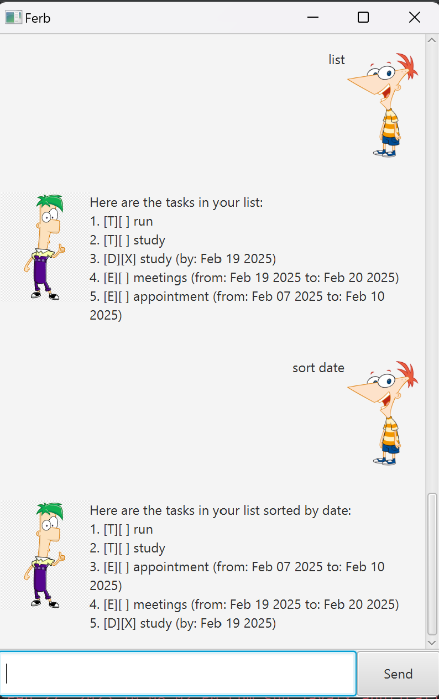

# Ferb Chatbot

## Table of Contents
- [Introduction](#introduction)
- [Features](#features)
- [Summary Table](#summary-table)

## Introduction
Ferb is a powerful task manager designed to help users organize their tasks efficiently. With Ferb, users can add, track, sort, and manage their to-do lists, deadlines, and events using simple commands.

## Features

### Task Management
- **Adding a Todo**
  - Adds a todo task to your task list.
  - **Command:** `todo <description>`
  - **Example:** `todo run`

- **Adding a Deadline**
  - Adds a deadline task to your task list.
  - **Command:** `deadline <description> /by <date time>`
  - **Date Time Format:** YYYY-MM-DD
  - **Example:** `deadline study /by 2025-02-19`

- **Adding an Event**
  - Adds an event task to your task list.
  - **Command:** `event <description> /from <start date time> /to <end date time>`
  - **Date Time Format:** YYYY-MM-DD
  - **Example:** `event  meeting /from 2025-02-19 /to 2025-02-20`

### Task Operations
- **Listing All Tasks**
  - Lists all tasks in your task list.
  - **Command:** `list`
  - **Example:** `list`

- **Marking a Task as Done**
  - Marks a task as done.
  - **Command:** `mark <task number>`
  - **Example:** `mark 2`

- **Unmarking a Task**
  - Unmarks a task as done.
  - **Command:** `unmark <task number>`
  - **Example:** `unmark 1`

- **Deleting a Task**
  - Deletes a task from your task list.
  - **Command:** `delete <task number>`
  - **Example:** `delete 1`

### Additional Features
- **Finding Tasks**
  - Finds tasks that contain a keyword.
  - **Command:** `find <keyword>`
  - **Example:** `find study`

- **Sorting the Task List**
  - Sorts tasks by either dates or task descriptions.
  - **Command:** `sort date` or `sort description`
  - **Example:** `sort date` or `sort description`

- **Exiting the Program**
  - Exits the Ferb chatbot application.
  - **Command:** `bye`
  - **Example:** `bye`

## Summary Table

| Feature | Description | Command Format |
|----------------------|--------------------------------------------|------------------------------|
|----------------------|--------------------------------------------|
| Adding a Todo | Adds a new task to your to-do list. | `todo <description>` |
| Adding a Deadline | Adds a task with a deadline. | `deadline <description> /by <date time>` |
| Adding an Event | Adds an event with start and end times. | `event <description> /from <start date time> /to <end date time>` |
| Listing All Tasks | Displays all tasks in your list. | `list` |
| Marking a Task as Done | Marks a specific task as completed. | `mark <task number>` |
| Unmarking a Task | Reverts a completed task back to pending. | `unmark <task number>` |
| Deleting a Task | Removes a specific task from your list. | `delete <task number>` |
| Finding Tasks | Searches for tasks containing a keyword. | `find <keyword>` |
| Sorting the Task List | Sorts tasks by either dates or task descriptions. | `sort date` or `sort description` |
| Exiting the Program | Closes the Ferb chatbot application. | `bye` |
